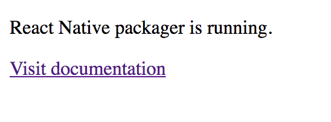

# UNOFFICIAL REACT NATIVE TUTORIAL

By Militsa Neykova & Dan Beebe

## Introduction

React Native is a framework used to construct mobile applications written in JavaScript, utilizing the React library to create the user interface. 

According to Facebook's documentation on React Native:

>
> With React Native, you don't build a 'mobile web app', an 'HTML5 app', or a 'hybrid app'. You build a real mobile app that's indistinguishable from an app built using Objective-C or Java. React Native uses the same fundamental UI building blocks as regular iOS and Android apps. You just put those building blocks together using JavaScript and React.
>

In other words, although React Native apps are written in JavaScript, their structure is essentially the same as other apps.

This unofficial tutorial includes sections on: (i) the origins of React Native; (ii) why you might want to use React Native; (iii) getting started with React Native; (iv) specific code examples; and (v) resources for further reading.

## Origins

In 2015, Facebook announced the creation of React Native:

>
> We introduced React to the world two years ago, and since then it's seen impressive growth, both inside and outside of Facebook. Today, even though no one is forced to use it, new web projects at Facebook are commonly built using React in one form or another, and it's being broadly adopted across the industry. Engineers are choosing to use React every day because it enables them to spend more time focusing on their products and less time fighting with their framework. It wasn't until we'd been building with React for a while, though, that we started to understand what makes it so powerful.
>
## Why Use React Native?

First of all, coding mobile apps is harder than coding for the browser. React Native is an attempt to make things slightly easier. 

Although the React apps are fundamentally made from the same building blocks as a native app, they are (arguably) better and faster. React Native applications can be much easier to code, less expensive, and save you a lot of time. It's all open source. One of the most valiable features that React gives to programmers is that it makes the views layers output of the states.

### Awesome Apps build in React Native

  * FACEBOOK
  * SKYPE
  * FACEBOOK ADs
  * INSTAGRAM
  * WALMART
  * AIRBNB
  * TESLA
  * YAHOO MAIL
   
## Getting Started

To start using React Native, you should install the React Native npm package by running the following code in your terminal:

        npm install -g react-native-cli

You'll also want to install yarn to help with setting up your React Native App, so run the following too:

        npm install -g yarn

To initialize a new React Native app, go into the folder where you want to create your app and run the following command:

        react-native init newAppName

You should make sure you have Java downloaded. Also, in order to see the content of the app as it would appear in a mobile device, you will need to set up an Android development environment:

[React Documentation on Android Setup](https://facebook.github.io/react-native/releases/0.23/docs/android-setup.html)

Getting everything set up is a bit complicated, so pay close attention to the documentation for setting up the android environment.

When you start your app, you should see the following in your terminal:

You will see the following in your browser when the app is running:

## Code Examples 

The following code examples are taken from a tutorial published by Traversy Media on YouTube: [React Native Crash Course YouTube Video](https://www.youtube.com/watch?v=mkualZPRZCs)

Here are a few examples of code in React Native: 

First, this code must be added to render the app using React Native in the index file:

        import {AppRegistry, Text, View} from 'react-native'

Rendering the information (also in the index file):

        export default class newAppName extends Component {
          render(){
            return(
              <View>
                <Text>Hello, World! This is a React Native App!!!!!!</Text>
              </View>
            );
          }
        }

Registering the application (also in the index file):

        AppRegistry.registerComponent('newAppName', () => myapp);

The Programmer can use props and state (just like in React):

         export default class newAppName extends Component {
           constructor(){
             super();
             this.state = {
                name: 'Militsa'
             }
            }

          render(){
            return(
              <View>
                <Text>{this.state.name}</Text>
                </View>        
              );
            }
          }

## Resources

### To Read
[React Native Official Site](http://www.reactnative.com/)

[Facebook's Tutorial on React Native](https://facebook.github.io/react-native/docs/tutorial.html)

[React Documentation on Android Setup](https://facebook.github.io/react-native/releases/0.23/docs/android-setup.html)

[2015 Article About the Origins of React Native](https://code.facebook.com/posts/1014532261909640/react-native-bringing-modern-web-techniques-to-mobile/)

### To Watch
[React Native Crash Course YouTube Video](https://www.youtube.com/watch?v=mkualZPRZCs)

[Video on Android SDK & AVD Setup For React Native](https://www.youtube.com/watch?v=KRLLjlpy0r4)

### To Download
[NPM Page for React-Native-Cli Package](https://www.npmjs.com/package/react-native-cli)

[Download Java](http://www.oracle.com/technetwork/java/javase/downloads/jdk8-downloads-2133151.htm)

[Download Android Studio](https://developer.android.com/studio/install.html)
